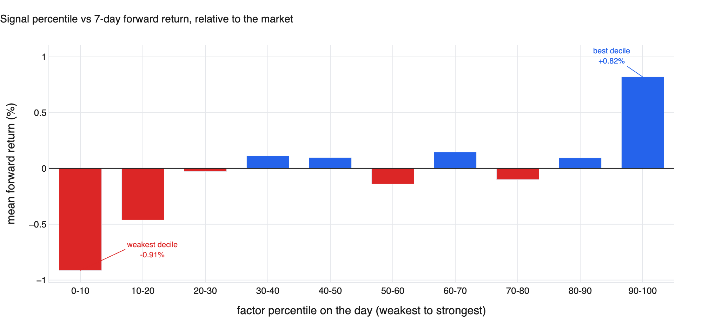
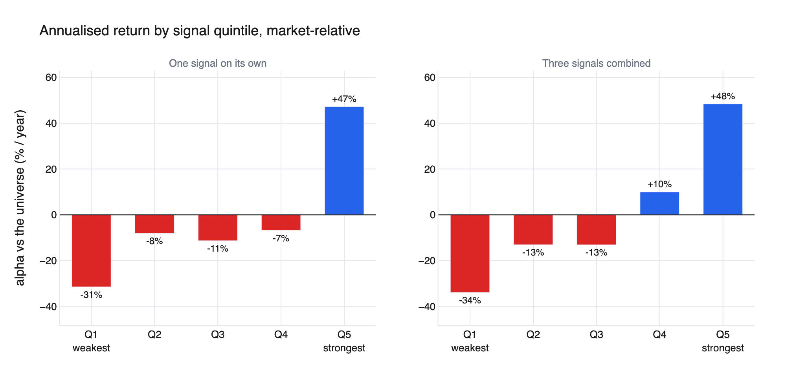
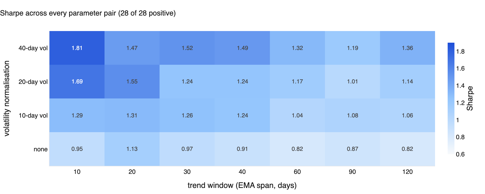
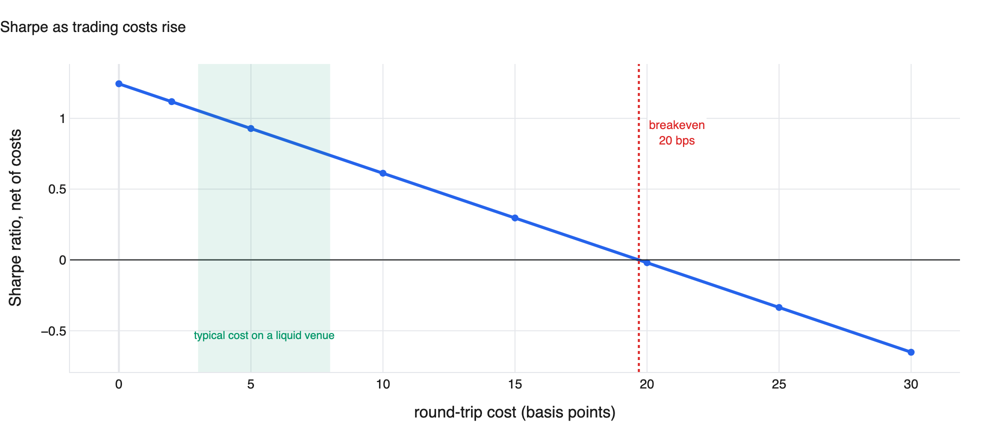
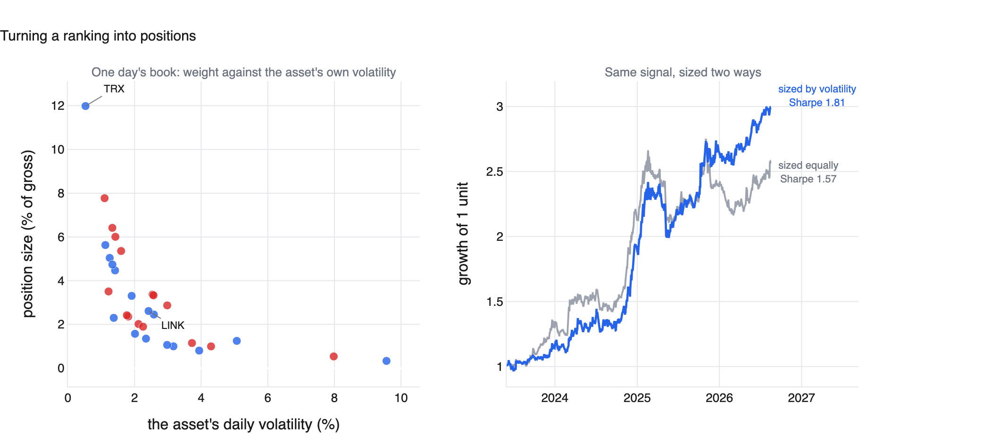
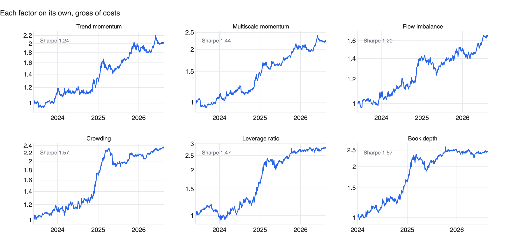
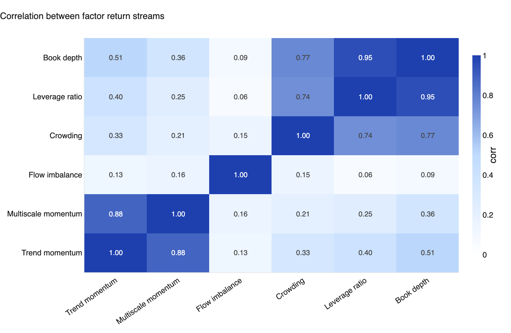
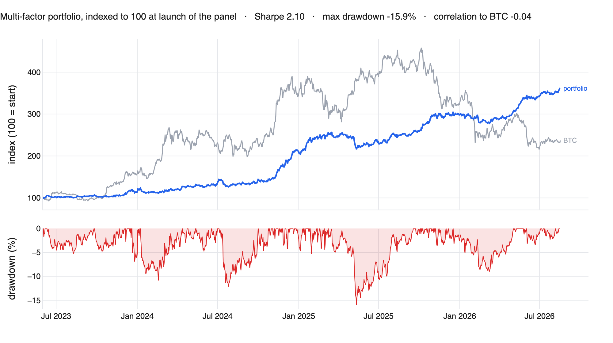
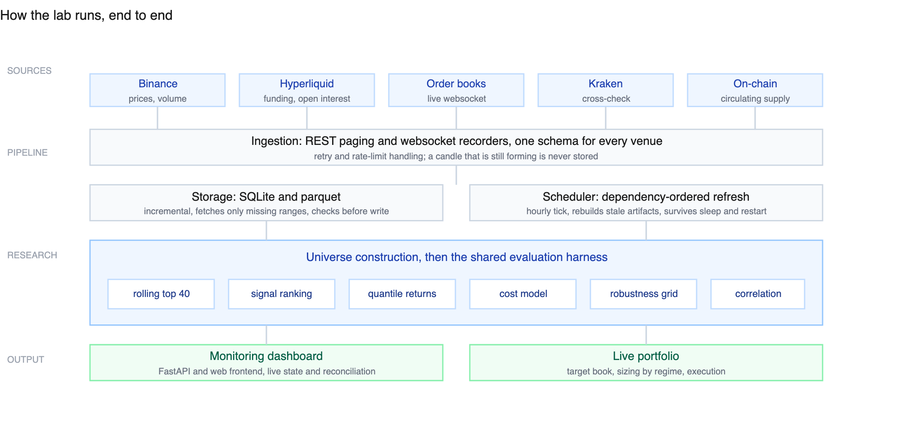

# Systematic research lab, crypto markets

A quantitative research pipeline I built and run on my own time. It collects
market data from several exchanges, looks for patterns that predict which
assets outperform, and tests those patterns hard enough to throw most of them
away.

This page walks through how that testing works, using one signal as the worked
example. **The performance numbers at the end are the least interesting part.
The method is the point:** with enough parameters to try, something will always
look profitable on past data, and the job is telling a real effect from a
coincidence.

The code that computes all of this is in [`factorlib/`](factorlib/). The
signals themselves are not published.

---

## The problem, in one paragraph

Every day, rank about 40 crypto assets by some measure computed from past
market data. Buy the top of the ranking, sell the bottom. If the measure
carries information about future returns, that book makes money regardless of
whether the market goes up or down.

The difficulty is not building it. It is that a backtest will happily tell you
a worthless signal is excellent. Assets that went to zero quietly disappear
from historical data. A single unshifted line of code lets tomorrow's
information leak into today's decision. Try forty parameter combinations and
the best one looks impressive by construction. Trading costs then quietly
remove whatever is left.

So every candidate goes through the same checks, in the same order, cheapest
first.

---

## The worked example

A momentum signal: how far an asset has moved from its own recent trend,
measured relative to how much it normally moves. An asset unusually far above
its trend tends to keep outperforming over the following days.

The universe is the 40 most liquid assets, rebuilt daily so it follows the
market. Test window: **June 2023 to August 2026**, 1172 trading days.

### Step 1. Does the signal order the cross-section at all?

Group every asset-day into deciles by signal strength, then look at what each
decile returned over the next 7 days, relative to the market.

The extremes separate cleanly: the weakest decile underperforms by 0.91% and
the strongest outperforms by 0.82% per week. But the middle is noise, and the
shape is a U rather than a staircase.

That distinction matters. A textbook factor produces a gradient, where each
decile beats the one below it. **This is a tail effect instead: the information
is concentrated in the extremes.** Knowing that changes what you can trade,
because the middle 60% of the ranking carries nothing worth acting on.

### Step 2. Where does the money actually come from?

Same question, framed as a portfolio: split into five buckets and measure the
annual return of each, relative to the universe. The left panel is the signal
on its own (ignore the right one for now, it comes back later).

Q5 returns +47% a year against the market, Q1 loses 31%, and Q2 to Q4 sit flat
within a few points of each other. The long/short works because **both ends
work**, not because there is a smooth gradient to ride.

This is also the honest reading of a common failure: had only Q5 been positive
with everything else flat, the signal would be one lucky bucket, and far more
fragile than a headline Sharpe suggests.

A related check, worth stating because it looks like a contradiction: the
day-to-day rank correlation between signal and next-day return is **slightly
negative** (-0.015). At a 7-day horizon it turns positive (+0.010) but is not
statistically strong on its own. The edge is not in daily regularity, it
accumulates over about a week and lives in the tails. A signal can be
genuinely tradable and still have an unimpressive daily correlation, which is
why this gets measured before any portfolio is built rather than after.

### Step 3. Is it the signal, or a lucky parameter choice?

The signal has two knobs: the trend window and the volatility window. Testing
one combination proves nothing, so all 28 get tested.

All 28 are positive, from 0.82 to 1.81, and the surface varies smoothly:
shorter trend windows beat longer ones, and volatility normalisation helps
almost everywhere. **The plateau is the result, not the best cell.** A single
bright square in an otherwise noisy grid is the signature of overfitting, and
would have killed this signal here.

### Step 4. Does it survive trading costs?

Rebalancing daily means turnover, and turnover costs money. This signal, traded
on its own, replaces about a third of its book every day.

The edge disappears entirely at a round-trip cost of **20 basis points**. Real
cost on a liquid venue is a few basis points, so there is genuine room between
what the signal earns and what it costs to run. Plenty of published strategies
fail exactly here: a Sharpe of 1.5 that breaks even at 2 bps is not a strategy,
it is a measurement of the fee schedule.

---

## Turning a ranking into positions

Everything above measures a signal. Trading it requires turning a list of
scores into actual position sizes, and that step has as much influence on the
result as the signal does.

**The comparison is always across assets, never against history.** Each day the
signal is computed for every asset in the universe, then converted to a rank
within that day: strongest, second strongest, and so on. Only the ordering is
used, not the raw value. This matters because raw values drift. A momentum
score of 2.0 means something different in a calm market than in a violent one,
but "the strongest of today's 40" means the same thing in both. Ranking within
the day also removes the market: if everything rises together, the ranking is
unchanged, which is what makes the result independent of market direction.

Practically, about 37 assets are scored each day and the book holds around 29
of them, long the top of the ranking and short the bottom, with the middle left
out. The two sides are sized to be equal, so the book is neutral by
construction rather than by forecast.

**Position size is then set by volatility, not by conviction.** Within each
side, a name's weight is proportional to the strength of its rank divided by
its own recent volatility.

The left panel is a single day's book. Every held name is plotted by its own
volatility against the size it received, and the relationship is clearly
inverse. TRX scores near the top of the ranking and gets 12% of the book
because it moves about 0.5% a day. LINK scores slightly higher still but
receives 2.6%, because it moves five times as much. Equal weighting would give
them identical sizes and let LINK dominate the day's outcome.

That is not a marginal adjustment. On a typical day the most volatile asset in
this universe moves **ten times** as much as the calmest, with the volatile
decile near 8.4% a day against 2.9% for the quiet one. Sizing every position
equally means a handful of the wildest names drive nearly all the risk, and the
portfolio stops expressing the signal and starts expressing those names.

The right panel shows what that costs, comparing the two sizing rules on the
identical signal, both scaled to the same volatility so the comparison is
risk-adjusted rather than a matter of running hotter. Sizing by volatility
lifts the Sharpe ratio from **1.57 to 1.81** and cuts the worst drawdown from
-21.8% to -16.4%. Same signal, same universe, same days: the only difference is
how much of each name gets held.

Two consequences worth stating, because both are constraints rather than
features. Weighting by inverse volatility tilts the book towards calmer, larger
assets, so a check that the result is not merely a size bet belongs in the
evaluation. And the largest single position averages about 11% of the book,
which is concentrated enough that caps per asset matter in live trading even
though they barely register in a backtest.

---

## From one signal to a portfolio

Six signals passed the checks above. Individually their Sharpe ratios run from
1.20 to 1.57.

But a new signal earns its place by being **different**, not by being good. If
it moves with something already in the portfolio, it adds risk without adding
information.

The structure is visible immediately. The two momentum signals correlate at
0.88, so they are one bet rather than two, and the better one replaces the
other instead of joining it. Crowding, leverage and book depth form a second
cluster at 0.74 to 0.95: three different measurements of the same underlying
thing, which is how heavily positioned the market already is. Flow imbalance
correlates below 0.16 with everything, which makes it the most valuable of the
six despite having the lowest standalone Sharpe.

So the portfolio that actually runs uses **three** of the six: the best
momentum signal, one positioning signal from the middle cluster, and flow
imbalance for being uncorrelated with both. The other three are held in
reserve, either replaced by something they correlate with or currently out of
favour.

How they get combined is deliberately unsophisticated. Each signal is converted
to a rank within the day, the ranks are averaged with **equal weight**, and the
combined ranking is then sized exactly like a single signal. No optimiser
chooses the weights.

That is a choice, not laziness. Fitting weights to three correlated signals
over three years of history produces numbers that look precise and are mostly
noise: the optimiser will happily allocate on the strength of one good quarter.
Equal weighting is a deliberately hard baseline, and anything more elaborate
has to beat it out of sample before it earns its place.

The one refinement in use is a seven-day smoothing of the combined ranking, and
it illustrates why gross performance is the wrong thing to optimise. Smoothing
**lowers** the gross Sharpe from 2.16 to 1.81, which looks like pure damage.
What it buys is turnover: 22% of the book per day instead of 51%. After a 5 bps
round-trip cost the two are close to even, 1.58 against 1.62, so more than half
the apparent gross advantage was never real money. It was a fee bill that had
not been counted yet, and the smoothed book gets there with less than half the
execution, which is worth more as size grows.

Combining signals does something the individual charts do not show. Averaging
the three rankings and re-sorting into quintiles gives the right-hand panel
from earlier:

The single signal was flat across Q2 to Q4 and only paid at the extremes. The
combined signal steps upward almost cleanly: -34%, -13%, -13%, +10%, +48%. Q2
and Q3 still tie, so it is not perfectly ordered, but the middle of the
ranking now carries information it did not carry before. **Three noisy tail
effects average into something closer to a gradient**, because the noise in
each is largely independent while the signal is not.

That improvement is visible in the result. Combined at equal risk:

| | value |
|---|---|
| Sharpe ratio | 2.10 |
| Maximum drawdown | -15.9% |
| Correlation to Bitcoin | -0.04 |
| Sharpe by year | 1.32 (2023), 2.72 (2024), 1.76 (2025), 2.39 (2026) |

The correlation to Bitcoin is the number I care about most. At -0.04 this is
not a disguised bet on crypto going up: it is long some assets and short
others, and the market direction cancels out. The chart shows what that means
in practice. Bitcoin roughly doubles, gives it all back, and ends the period
below where it peaked, while the portfolio compounds through both halves and
draws down less than 16% at its worst.

**Caveats, since a results section without them is marketing.** These figures
are gross of costs and measured on the research harness, not a live trading
statement. Three years is a short window, and it contains one full crypto
cycle rather than several. Results vary a lot year to year, from 1.32 to 2.72.
Every signal was developed on this same history, so the usual warning about
in-sample results applies: the honest test is what happens on data that did
not exist when the signals were chosen.

---

## The system underneath

None of the above works without the data pipeline that feeds it, which is the
larger part of the engineering.

- **Ingestion.** REST and websocket collectors across several venues, each with
  its own API, rate limits and quirks, normalised into one schema.
- **Storage.** SQLite and parquet, incremental: it fetches only the ranges it
  is missing. Integrity checks run before anything is written. One example that
  cost real debugging time: a candle for the current day looks exactly like a
  finished one, and storing it corrupts every calculation downstream until the
  day rolls over.
- **Scheduling.** An hourly tick runs jobs in dependency order and rebuilds
  whatever has gone stale, surviving laptop sleep and restarts.
- **Monitoring.** A FastAPI backend and web frontend showing live state,
  historical reconciliation and configuration, so a broken upstream feed is
  visible immediately rather than three weeks later.

**Stack:** Python, pandas, NumPy, SciPy, FastAPI, plotly, SQLite, parquet.

---

## The code

[`factorlib/`](factorlib/) contains the evaluation harness: universe
construction, signal scoring, portfolio construction, cost modelling. Worth
reading if you want to see how the measurement is done.

| file | what it does |
|---|---|
| [`factorlib/evaluate.py`](factorlib/evaluate.py) | the shared harness: rank correlations, quantile returns, drawdowns, robustness grids |
| [`factorlib/portfolio.py`](factorlib/portfolio.py) | combining signals, position sizing, turnover and cost accounting |
| [`factorlib/universe.py`](factorlib/universe.py) | which assets are tradable on which dates, including ones that later died |

This code is published to show the method. It is extracted from a private lab,
it is not maintained as a package, and the signal definitions are not included.

## Licence

MIT.
